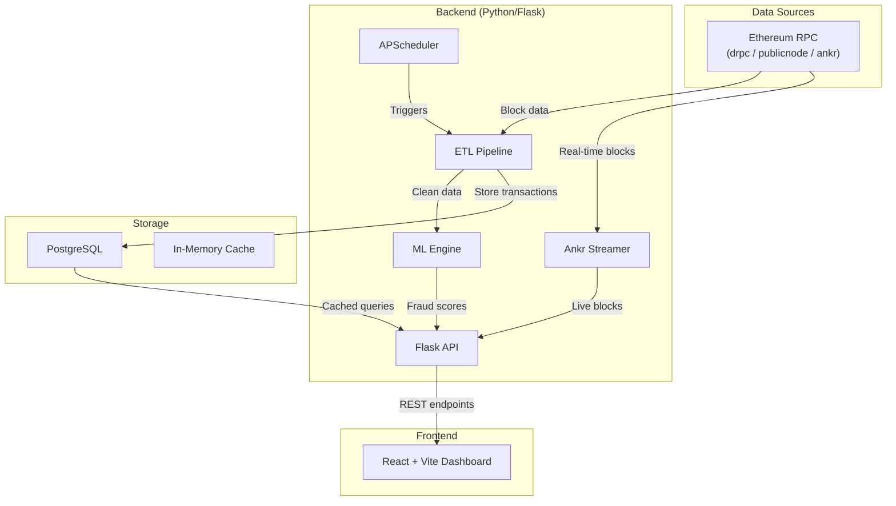
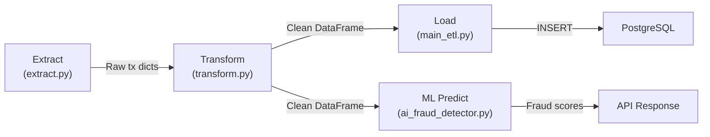

# Blockchain-ML Fraud Detection System — Full Roadmap

## Project Overview

A production-ready **blockchain fraud detection system** that ingests Ethereum transactions via RPC, processes them through an ETL pipeline, applies ML-based fraud detection (Random Forest + Isolation Forest), and displays results in a React dashboard. Deployable via Docker Compose or Kubernetes.

---

## Architecture



---

## Data Flow: ETL Pipeline



| Phase | File | Purpose |
|-------|------|---------|
| **Extract** | [extract.py](file:///home/sugangokul/Desktop/blockchain-ml/src/backend/etl/extract.py) | Fetches block data + transaction receipts from RPC. Parallel via `ThreadPoolExecutor`. Caches blocks in memory (100-block LRU). |
| **Transform** | [transform.py](file:///home/sugangokul/Desktop/blockchain-ml/src/backend/etl/transform.py) | Converts raw dicts → Pandas DataFrame. Renames columns for DB compatibility. Fills NaN values. Validates required columns. |
| **Load** | [main_etl.py](file:///home/sugangokul/Desktop/blockchain-ml/src/backend/etl/main_etl.py) | Orchestrates E→T→L. Manages [pipeline_state](file:///home/sugangokul/Desktop/blockchain-ml/src/backend/etl/main_etl.py#152-165) table for resume tracking. Processes blocks in configurable `BATCH_SIZE` chunks. |

---

## Module Breakdown

### 1. ETL Layer — `src/backend/etl/`

| File | Lines | Responsibility |
|------|-------|----------------|
| [extract.py](file:///home/sugangokul/Desktop/blockchain-ml/src/backend/etl/extract.py) | 128 | Block/transaction extraction with parallel RPC calls |
| [transform.py](file:///home/sugangokul/Desktop/blockchain-ml/src/backend/etl/transform.py) | 102 | Data cleaning, type casting, column renaming |
| [main_etl.py](file:///home/sugangokul/Desktop/blockchain-ml/src/backend/etl/main_etl.py) | 316 | Full ETL orchestrator with DB schema creation |
| [ankr_streamer.py](file:///home/sugangokul/Desktop/blockchain-ml/src/backend/etl/ankr_streamer.py) | 330+ | Real-time block polling via Ankr RPC |
| [streaming_manager.py](file:///home/sugangokul/Desktop/blockchain-ml/src/backend/etl/streaming_manager.py) | 159 | Global singleton to manage streaming lifecycle |
| [stream_service.py](file:///home/sugangokul/Desktop/blockchain-ml/src/backend/etl/stream_service.py) | 120 | Standalone streaming service entry point |

### 2. ML Engine — `src/backend/ml/`

| File | Lines | Responsibility |
|------|-------|----------------|
| [ai_fraud_detector.py](file:///home/sugangokul/Desktop/blockchain-ml/src/backend/ml/ai_fraud_detector.py) | 383 | Core ML: feature extraction, RandomForest training, IsolationForest anomaly detection, prediction, reporting |
| [ai_integration.py](file:///home/sugangokul/Desktop/blockchain-ml/src/backend/ml/ai_integration.py) | 192 | 3 integration patterns (after-transform, before-load, parallel) |
| [realtime_processor.py](file:///home/sugangokul/Desktop/blockchain-ml/src/backend/ml/realtime_processor.py) | 269 | Continuous block processor with multi-format output (console, JSON, CSV, webhook) |
| [train_ai_model.py](file:///home/sugangokul/Desktop/blockchain-ml/src/backend/ml/train_ai_model.py) | 147 | Synthetic data generation + model training script |

**ML Features Used** (9 total):
`tx_volume_1h`, `avg_value_1h`, `gas_price_zscore`, `value_zscore`, `address_age_days`, `unique_addresses`, `time_of_day`, `value_deviation`, `gas_deviation`

### 3. API Dashboard — `src/backend/api/`

| File | Lines | Responsibility |
|------|-------|----------------|
| [ai_dashboard.py](file:///home/sugangokul/Desktop/blockchain-ml/src/backend/api/ai_dashboard.py) | 1218 | Flask server: REST API, async jobs, PostgreSQL caching, mode enforcement, model toggling, streaming control |

**Key Endpoints:**
| Route | Method | Purpose |
|-------|--------|---------|
| `/api/health` | GET | System health check |
| `/api/transactions` | POST | Fetch + analyze transactions |
| `/api/transactions/async` | POST | Start async processing job |
| `/api/transactions/job/<id>` | GET | Poll async job status |
| `/api/options` | GET | Get processing options by mode |
| `/api/stats` | GET | Network stats (block, gas) |
| `/api/model-toggle` | POST | Enable/disable ML at runtime |
| `/api/streaming/stats` | GET | Ankr streaming metrics |
| `/api/system/status` | GET | Full system status |

### 4. Frontend — `src/frontend/`

**Stack**: React 18 + Vite + Material UI + Framer Motion + Lucide Icons + Axios

| File | Purpose |
|------|---------|
| [App.jsx](file:///home/sugangokul/Desktop/blockchain-ml/src/frontend/src/App.jsx) | Main app: mode selection, options panel, transaction table, stats cards |
| [ModeSelector.jsx](file:///home/sugangokul/Desktop/blockchain-ml/src/frontend/src/components/ModeSelector.jsx) | Scheduled vs Real-time mode picker |
| [TransactionTable.jsx](file:///home/sugangokul/Desktop/blockchain-ml/src/frontend/src/components/TransactionTable.jsx) | Paginated table with fraud risk badges, Etherscan links |
| [StreamingStatus.jsx](file:///home/sugangokul/Desktop/blockchain-ml/src/frontend/src/components/StreamingStatus.jsx) | Live streaming health indicator |
| [useStreamingData.js](file:///home/sugangokul/Desktop/blockchain-ml/src/frontend/src/hooks/useStreamingData.js) | Polling hook for streaming stats |

### 5. Infrastructure

| Component | File(s) | Purpose |
|-----------|---------|---------|
| Docker | [docker-compose.yml](file:///home/sugangokul/Desktop/blockchain-ml/docker/docker-compose.yml) + `Dockerfile.*` | 5 services: postgres, backend, frontend, ml_worker, scheduler (+optional ankr-streamer) |
| Kubernetes | [k8s/](file:///home/sugangokul/Desktop/blockchain-ml/k8s/) (10 YAMLs) | Namespace, ConfigMap, Secrets, PVC, StatefulSet (Postgres), Deployments, CronJob, Ingress |
| Utils | [disk_cleanup.py](file:///home/sugangokul/Desktop/blockchain-ml/src/backend/utils/disk_cleanup.py) | Auto disk space monitoring + cleanup with parallel file deletion |

---

## Bugs Found & Fixed (16 total)

### Critical Data Integrity (4 bugs)

| # | File | Bug | Impact |
|---|------|-----|--------|
| 01 | `transform.py` | Column rename `transaction_hash→tx_hash` overwrote original `tx_hash` | Data loss — tx hashes corrupted |
| 02 | `transform.py` | Identity renames (`block_number→block_number`) cluttered the mapping | Maintenance confusion |
| 08 | `ai_integration.py` | `enrich_with_fraud_scores()` discarded fraud predictions, returned only anomaly results | **All fraud scores lost** |
| 09 | `extract.py` | Both `tx_hash` AND `transaction_hash` emitted with same value | Root cause of BUG-01 |

### Logic Errors (4 bugs)

| # | File | Bug | Impact |
|---|------|-----|--------|
| 03 | `ai_fraud_detector.py` | Missing parentheses in bitwise operator chain | Unexpected label generation |
| 04 | `ai_fraud_detector.py` | `generate_report()` hard-coded column names that may not exist | `KeyError` crashes |
| 06 | `ankr_streamer.py` | Block dicts passed to `transform_data()` which expects transaction rows | `TypeError`/wrong data |
| 16 | `realtime_processor.py` | Hard-coded `interval=30` overrides `POLLING_INTERVAL=10` env var | Config ignored |

### Runtime Errors (3 bugs)

| # | File | Bug | Impact |
|---|------|-----|--------|
| 05 | `ankr_streamer.py` | `asyncio.run(asyncio.sleep())` in sync code | New event loop each call, errors in threaded contexts |
| 11 | `ai_dashboard.py` | `FRONTEND_DIR` pointed to wrong directory | 404 for all static files |
| 13 | `ai_dashboard.py` | `Decimal` returned in JSON response | `TypeError: Object of type Decimal is not JSON serializable` |

### Memory / Resource Leaks (3 bugs)

| # | File | Bug | Impact |
|---|------|-----|--------|
| 12 | `ai_dashboard.py` | Jobs dict never cleaned up | Unbounded memory growth |
| 14 | `ai_dashboard.py` | `response_cache` declared but never used | Dead code |
| 15 | `extract.py` | Cache eviction removed only 1 entry when >100 | Memory growth under load |

### Thread Safety (2 bugs)

| # | File | Bug | Impact |
|---|------|-----|--------|
| 07 | `ankr_streamer.py` | Background thread `daemon=False` | Process hangs on exit |
| 10 | `disk_cleanup.py` | `ThreadPoolExecutor` created but deletions ran sequentially | No parallelism benefit |

---

## Deployment Guide

### Docker Compose (Quick Start)
```bash
cp .env.example .env
# Edit .env with your RPC_URL and DB credentials
cd docker && docker-compose up -d
```
- **Frontend**: http://localhost:3000
- **Backend API**: http://localhost:5000
- **Optional Ankr Streaming**: `docker-compose --profile streaming up -d`

### Kubernetes (Production)
```bash
kubectl apply -f k8s/01-namespace.yaml
kubectl apply -f k8s/02-configmap.yaml
# ... apply all 10 manifests in order
kubectl port-forward -n blockchain-ml svc/frontend 3000:3000
```

---

## Future Enhancement Roadmap

| Priority | Enhancement | Description |
|----------|-------------|-------------|
| 🔴 High | **Real labeled fraud dataset** | Replace synthetic labels with real fraud data (e.g., Elliptic dataset) for production accuracy |
| 🔴 High | **WebSocket live updates** | Replace polling with WebSocket push for real-time dashboard updates |
| 🟡 Medium | **Model versioning** | Use MLflow or similar for model registry, A/B testing, and rollback |
| 🟡 Medium | **Rate limiting** | Add RPC call rate limiting to avoid getting blocked by public endpoints |
| 🟡 Medium | **Authentication** | Add JWT/OAuth2 authentication to the API and dashboard |
| 🟢 Low | **Multi-chain support** | Extend to BSC, Polygon, Arbitrum via configurable chain ID |
| 🟢 Low | **Alert system** | Email/Slack/Discord notifications when high-risk transactions detected |
| 🟢 Low | **Grafana dashboards** | Export Prometheus metrics for observability |
